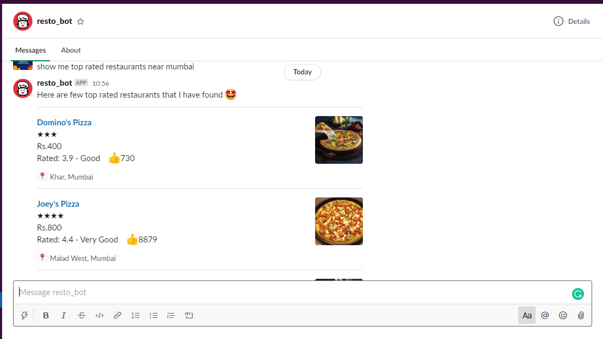
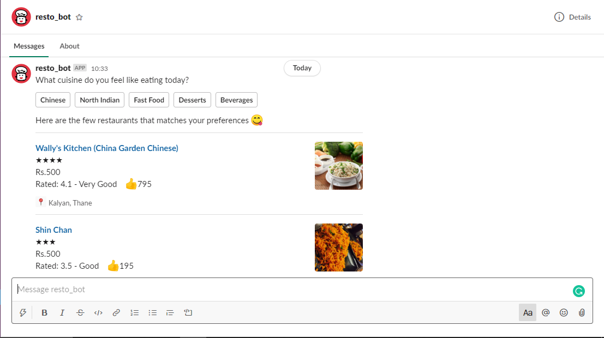

# Restaurant Search Bot
Restaurants Search Bot using Rasa Framework &amp; Zomato API

## Screens
  !

 

## Demo
Check out the demo @ https://youtu.be/j1BvTwNZKLY

## Features
- User can search top-rated restaurants
- User can search restaurants using location and cuisine
- Support for Interactive elements of Slack

## Rasa Components Used
- [Transformer Embedding Dialogue Policy (TEDP)](https://rasa.com/docs/rasa/core/policies/#ted-policy)
- [Retrieval Actions](https://rasa.com/docs/rasa/core/retrieval-actions/#retrieval-actions)
- [DIET Classifier](https://rasa.com/docs/rasa/nlu/components/#dietclassifier)

## Prerequisites
- Zomato API Key for searching the Restaurants, you can get it [here](https://developers.zomato.com/documentation#/)
- Rasa Framework, check the details [here](https://rasa.com/docs/rasa/user-guide/installation/)

## How to use
- Clone the repo
- add the Zomato API key to `zomatoApi.py` file
- open the terminal in the project directory and run the below commands
  - > rasa train
  - Once the bot has been trained, run the bot using the below commands
  - > rasa run actions
  - > rasa run -m models --enable-api --cors "*" --debug
  
  
  
  
 **Note**: *While developing this bot, I had used Rasa v.1.9.7 and there was some issue with the slack connector of Rasa, I have found a temporary fix, I have mentioned this in the [issue](https://github.com/RasaHQ/rasa/issues/5704). If you want to use the UI which you see in the above screens, you check the [chatbot widget](https://github.com/JiteshGaikwad/Chatbot-Widget)*

  
